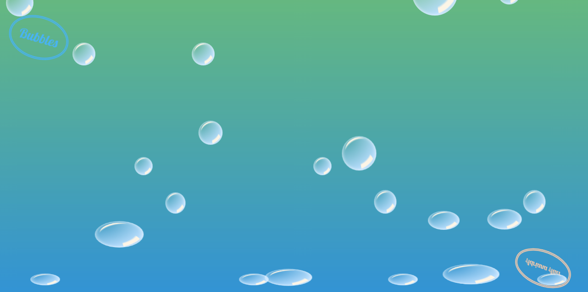

# Bubbles

Bubbles is a demonstration of CSS3 techniques.  It uses pseudo elements and radial gradients to create the effect of translucent, three-dimensional bubbles, and deploys keyframe animation technology to make them move realistically. The spinning text at the top left and bottom right corners showcases CSS transforms on all three axes.  Mousing over any individual bubble will restart its animation cycle, essentially meaning that you can adjust the bubbles' distribution on your screen.  If you catch the bubbles at the top of the screen, you can even pop them!  To fill your own computer screen with bubbles, visit http://adrianaalter.github.io/Bubbles/.

</img>
