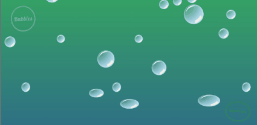

# Bubbles

<<<<<<< HEAD
Bubbles is a demonstration of CSS3 techniques.  It uses pseudo elements and radial gradients to create the effect of translucent, three-dimensional bubbles, and deploys keyframe animation technology to make them move realistically. The spinning text at the top left and bottom right corners showcases CSS transforms on all three axes.  Mousing over any individual bubble will restart its animation cycle, essentially meaning that you can adjust the bubbles' distribution on your screen.  If you catch the bubbles at the top of the screen, you can even pop them!  To fill your own computer screen with bubbles, just download the HTML file and open it in Google Chrome.
=======
<a href="http://adrianaalter.github.io/Bubbles/">Bubbles</a> is a demonstration of CSS3 techniques.  It uses pseudo elements and radial gradients to create the effect of translucent, three-dimensional bubbles, and deploys three different keyframe animation technology to make them move realistically.  For example, the following keyframe sequence causes the bubbles to start out slightly flattened, and gradually become fully circular as they drift upwards:

<pre><code>
  @keyframes squish {
    0% { transform: scaleY(0.5) scaleX(1.5); }
    15% { transform: scaleY(0.75) scaleX(1.25); }
    20% { transform: scaleY(1.05) scaleX(0.95); }
    25%, 35%, 45%, 55%, 65%, 75%, 85%, 95% {
      transform: scale(.9);
    }
    30%, 40%, 50%, 60%, 70%, 80%, 90%, 100% {
      transform: scale(1);
    }
  }
</code></pre>

The spinning text at the top left and bottom right corners showcases CSS transforms on all three axes, as well as changing color and position:

<pre><code>
  @keyframes spin {
    0% {transform: rotateY(0deg) rotateZ(0deg);}
    50% {transform:  rotateY(180deg) rotateZ(180deg);}
    100% {transform:  rotateZ(360deg) rotateZ(360deg);}
  }
</code></pre>

Mousing over any individual bubble will restart its animation cycle, essentially meaning that you can adjust the bubbles' distribution on your screen.  If you catch the bubbles at the top of the screen, you can even pop them!  To fill your own computer screen with bubbles, just visit http://adrianaalter.github.io/Bubbles/.

</img>
>>>>>>> gh-pages
